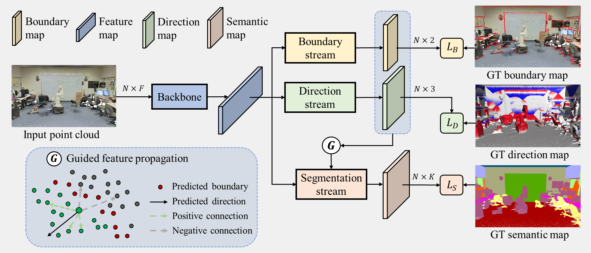

# Pytorch Implementation of Push-the-Boundary

This repo is implementation for [Push-the-Boundary: Boundary-aware Feature Propogation for Semantic Segmentation of 3D Point Clouds](https://arxiv.org/pdf/2212.12402.pdf) in pytorch.



## Baseline Reference
Two networks [PointNet](https://github.com/yanx27/Pointnet_Pointnet2_pytorch) and [KP-Conv](https://github.com/HuguesTHOMAS/KPConv-PyTorch) are adopted as baselines in our work. 

## Installation
The codes using both baselines are tested on Ubuntu 20.04, Python 3.8. Install the following dependencies:
- numpy
- scikit-learn 0.23.2
- Pytorch 1.7.1
- cudatoolkit 10.1

For KP-Conv backbone, you also need to compile the C++ extension modules in `cpp_wrappers`. Open a terminal in this folder, and run:

        sh compile_wrappers.sh


## Indoor Semantic Segmentation (S3DIS)
### Data Preparation
Download the data from the [data](https://surfdrive.surf.nl/files/index.php/s/ku7ZExu9R5oDSlJ) link.

For running PointNet++ backbone, use the data extracted from `pointnet_data_s3dis/stanford_indoor3d.zip`. Unzip the data and put the .npy files under the folder `PointNet2_Backbone/data_s3dis/`. The point clouds are pre-processed, containing the following fields:
- coordinate, i.e., x, y, z
- color, i.e., r, g, b
- label
- normal, i.e., nx, ny, nz
- boundary, i.e., 0 for interior and 1 for boundary
- direction, i.e., dx, dy, dz

For running PointNet++ backbone, use the data extracted from `kpconv_data_s3dis/s3dis.zip`. The scenes are stored in .ply format, containing the same fields. You can also find the subsampled point clouds using the default voxel size of 5cm. Unzip the data and put both the original point clouds and the subsampled point clouds under the folder `KPCOnv_Backbone/data_s3dis/`.Note that there is an additional field "dis_boundary", denoting the distance from current point to the closest boundary point. However, this field is not used in our final network.

### Running using the baseline PointNet++
Train the model using:

        python train_semseg_boundary.py

Test the model using:

        python test_semseg_boundary.py --log_dir your_resulted_log --test_area 5

with the specified path to your model directory.

### Running using the baseline KP-Conv
Train the model using:

        python train_S3DIS_boundary.py

Test the model using:

        python test_s3dis.py

In L11, you can specify your model directory.

## Outdoor Semantic Segmentation (SensatUrban)
Under preparation ......

## Visualization
The segmentation outputs are stored as .ply files which contain the predictions of pointwise boundaries, directions and semantic classes. They can be visualized using various softwares (e.g., [Easy3D](https://github.com/LiangliangNan/Easy3D), [CloudCompare](https://www.danielgm.net/cc/), [MeshLab](https://www.meshlab.net/)).

## Citation
If you use (part of) the code / approach in a scientific work, please cite our paper:
```
@inproceedings{du2022pushboundary,
  title={Push-the-Boundary: Boundary-aware Feature Propagation for Semantic Segmentation of 3D Point Clouds},
  author={Du, Shenglan and Ibrahimli, Nail and Stoter, Jantien and Kooij, Julian and Nan, Liangliang},
  journal={International conference on 3D vision (3DV)},
  year={2022}
}
```

